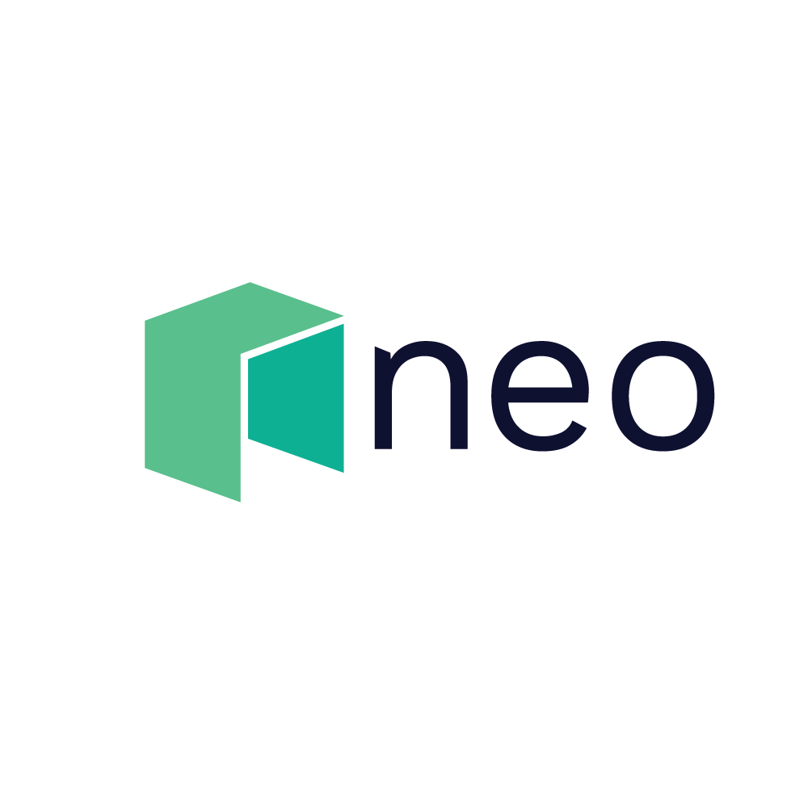
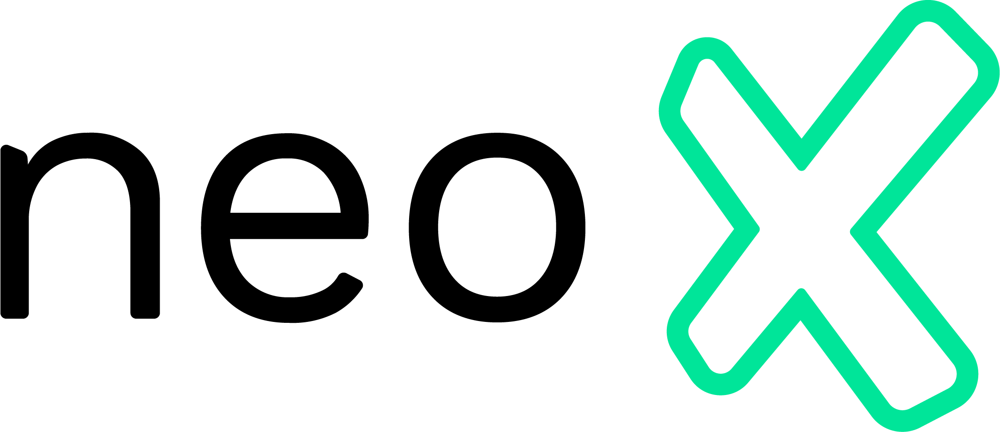
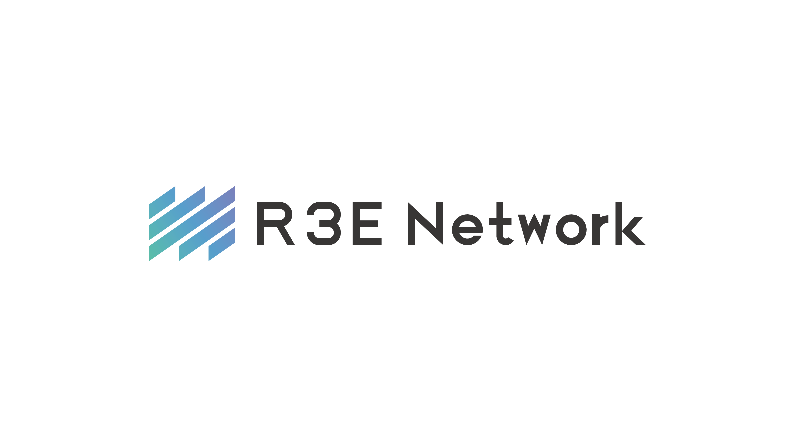

# R3E Neo Service Layer

<div align="center">
  <p>
    &nbsp;&nbsp;&nbsp;&nbsp;
    &nbsp;&nbsp;&nbsp;&nbsp;
    
  </p>
</div>

[](https://github.com/R3E-Network/r3e-faas/actions/workflows/rust.yml)
[](https://crates.io/crates/r3e-faas)
[](https://docs.rs/r3e-faas)
[](https://opensource.org/licenses/MIT)
[](https://opensource.org/licenses/Apache-2.0)

The R3E Neo Service Layer is a comprehensive blockchain service infrastructure designed specifically for Neo N3 and Ethereum applications. It enables developers to deploy and execute JavaScript functions in a secure, scalable, and cost-effective environment, with built-in support for advanced blockchain services and cryptographic capabilities.

## Architecture Overview

```
+-----------------------------------------------------------------------------------+
|                         Neo Service Layer Architecture                            |
+-----------------------------------------------------------------------------------+
|                                                                                   |
|                              +----------------+                                   |
|                              | Applications   |                                   |
|                              +-------+--------+                                   |
|                                      |                                            |
|                                      v                                            |
|                              +----------------+                                   |
|                              | API Layer      |                                   |
|                              | (r3e-api)      |                                   |
|                              +-------+--------+                                   |
|                                      |                                            |
|                                      v                                            |
|  +----------------+  +----------------+  +----------------+  +----------------+   |
|  | Core Services  |  | Neo Services   |  | Oracle Service |  | TEE Service   |   |
|  | (r3e-core)     |  | (r3e-neo-      |  | (r3e-oracle)   |  | (r3e-tee)     |   |
|  |                |  | services)       |  |                |  |               |   |
|  +----------------+  +----------------+  +----------------+  +----------------+   |
|         |                    |                   |                   |            |
|         |                    |                   |                   |            |
|         v                    v                   v                   v            |
|  +----------------+  +----------------+  +----------------+  +----------------+   |
|  | Gas Bank       |  | Meta Tx        |  | Event          |  | Worker        |   |
|  |                |  |                |  | Processing     |  | (r3e-worker)  |   |
|  |                |  |                |  | (r3e-event)    |  |               |   |
|  +----------------+  +----------------+  +----------------+  +----------------+   |
|         |                    |                   |                   |            |
|         |                    |                   |                   |            |
|         v                    v                   v                   v            |
|  +----------------+  +----------------+  +----------------+  +----------------+   |
|  | Abstract       |  | FHE Service    |  | ZK Service     |  | Storage       |   |
|  | Account        |  | (r3e-fhe)      |  | (r3e-zk)       |  | (r3e-store)   |   |
|  |                |  |                |  |                |  |               |   |
|  +----------------+  +----------------+  +----------------+  +----------------+   |
|                                      |                                            |
|                                      v                                            |
|                              +----------------+                                   |
|                              | Integration    |                                   |
|                              | Layer          |                                   |
|                              +-------+--------+                                   |
|                                      |                                            |
|                                      v                                            |
|                              +----------------+                                   |
|                              | Neo N3         |                                   |
|                              | Blockchain     |                                   |
|                              +----------------+                                   |
|                                                                                   |
+-----------------------------------------------------------------------------------+
```

The Neo Service Layer architecture consists of several key components:

1. **API Layer (r3e-api)**: Provides REST, GraphQL, and WebSocket interfaces for applications to interact with the service layer.

2. **Service Layer**: Contains the core services that power the Neo Service Layer:
   - **Core Services (r3e-core)**: Fundamental services for the platform operation
   - **Neo Services (r3e-neo-services)**: Specialized services for Neo N3 blockchain
   - **Oracle Service (r3e-oracle)**: Provides off-chain data to smart contracts
   - **TEE Service (r3e-tee)**: Secure computing environments for sensitive operations

3. **Integration Layer**: Connects the service layer to the underlying blockchain:
   - **Event Processing (r3e-event)**: Handles blockchain events and triggers
   - **Worker (r3e-worker)**: Executes functions in response to events
   - **Storage (r3e-store)**: Persistent storage for service data
   - **Cryptographic Services**: FHE and ZK services for privacy-preserving operations

4. **Neo N3 Blockchain**: The underlying blockchain platform that the service layer integrates with.

## Application Interaction Flow

The following diagram illustrates how applications interact with the Neo Service Layer:

```
+-----------------------------------------------------------------------------------+
|                    Neo Service Layer Application Interaction                      |
+-----------------------------------------------------------------------------------+
|                                                                                   |
|  +----------------+                                                               |
|  | Applications   |                                                               |
|  | - dApps        |                                                               |
|  | - Wallets      |                                                               |
|  | - User         |                                                               |
|  |   Interfaces   |                                                               |
|  +-------+--------+                                                               |
|          |                                                                        |
|          | 1. API Requests (REST/GraphQL/WebSockets)                             |
|          v                                                                        |
|  +----------------+                                                               |
|  | API Layer      |                                                               |
|  | (r3e-api)      |                                                               |
|  +-------+--------+                                                               |
|          |                                                                        |
|          | 2. Service Requests                                                    |
|          v                                                                        |
|  +----------------+     +----------------+     +----------------+                 |
|  | Neo Services   |     | Oracle Service |     | TEE Service    |                 |
|  | - Gas Bank     |     | - Price Data   |     | - Secure       |                 |
|  | - Meta Tx      |     | - Random       |     |   Computation  |                 |
|  | - Abstract     |     | - Custom Data  |     | - Attestation  |                 |
|  |   Account      |     |                |     |                |                 |
|  +-------+--------+     +-------+--------+     +-------+--------+                 |
|          |                      |                      |                          |
|          | 3. Process           | 3. Process           | 3. Process               |
|          |    Requests          |    Requests          |    Requests              |
|          v                      v                      v                          |
|  +----------------+     +----------------+     +----------------+                 |
|  | Event          |     | Worker         |     | Cryptographic  |                 |
|  | Processing     |     | - Execute      |     | Services       |                 |
|  | - Triggers     |     |   Functions    |     | - FHE          |                 |
|  | - Notifications|     | - Process      |     | - ZK           |                 |
|  |                |     |   Events       |     |                |                 |
|  +-------+--------+     +-------+--------+     +-------+--------+                 |
|          |                      |                      |                          |
|          | 4. Blockchain        | 4. Blockchain        | 4. Blockchain            |
|          |    Integration       |    Integration       |    Integration           |
|          v                      v                      v                          |
|  +------------------------------------------------------------------+            |
|  | Integration Layer                                                 |            |
|  | - Blockchain Connectors                                           |            |
|  | - State Synchronization                                           |            |
|  | - Event Monitoring                                                |            |
|  +---------------------------+----------------------------------+----+            |
|                              |                                                    |
|                              | 5. Blockchain Transactions                         |
|                              v                                                    |
|                     +----------------+                                            |
|                     | Neo N3         |                                            |
|                     | Blockchain     |                                            |
|                     +----------------+                                            |
|                                                                                   |
+-----------------------------------------------------------------------------------+
```

### How Applications Interact with the Neo Service Layer

1. **Application Entry Points**:
   - **dApps**: Decentralized applications built on Neo N3 blockchain
   - **Wallets**: Neo-compatible wallets that integrate with the service layer
   - **User Interfaces**: Custom frontends that leverage Neo services

2. **API Interaction Methods**:
   - **REST API**: Standard HTTP endpoints for synchronous operations
   - **GraphQL**: Flexible query language for complex data requirements
   - **WebSockets**: Real-time event streaming and notifications

3. **Interaction Flow**:
   - Applications send requests to the API Layer using REST, GraphQL, or WebSockets
   - The API Layer authenticates, validates, and routes requests to appropriate services
   - Service components process requests and interact with the blockchain as needed
   - Results are returned to applications through the same communication channel
   - Real-time updates are pushed to applications via WebSocket connections

4. **Common Application Scenarios**:
   - **Gas Management**: Applications use the Gas Bank service to manage transaction fees
   - **Meta Transactions**: Applications enable gasless transactions for improved UX
   - **Data Feeds**: Applications consume oracle data for price information and external data
   - **Secure Computation**: Applications leverage TEE for confidential operations
   - **Event Monitoring**: Applications subscribe to blockchain events and triggers
   - **Privacy-Preserving Operations**: Applications use ZK and FHE services for private data

5. **Developer Experience**:
   - SDKs available for JavaScript, Python, and Rust
   - Comprehensive API documentation with examples
   - Local development environment with blockchain simulators
   - Testnet integration for pre-production testing

## Key Features

- **Comprehensive Neo N3 Services**: Specialized services designed for Neo N3 blockchain applications
- **Blockchain Integration**: Seamless integration with Neo N3 and Ethereum blockchains
- **Secure Execution Environments**: Isolated execution environments for blockchain operations
- **Event-Driven Architecture**: Trigger services based on blockchain events, time schedules, or market conditions
- **Built-in Service Suite**: Comprehensive suite of services for common blockchain operations
- **Trusted Execution Environment (TEE)**: Support for secure computing using Intel SGX and AWS Nitro
- **Zero-Knowledge Computing**: ZK-SNARK implementations for privacy-preserving computations
- **Fully Homomorphic Encryption**: Compute on encrypted data without decryption
- **Meta Transactions**: Support for gasless transactions on Neo N3 and Ethereum (EIP-712)
- **Secret Management**: Secure storage and management of sensitive data
- **High-Performance Storage**: RocksDB-based persistent storage for service data
- **Custom Triggers**: Define complex event triggers from multiple sources
- **Auto Contract Execution**: Automatically invoke smart contracts based on triggers

## Service Components

### Core Services

- **Balance Management**: Track and manage user balances for service usage
- **Identity Verification**: Secure user authentication and authorization
- **Pricing Service**: Dynamic pricing for service resources
- **Indexing Service**: Efficient data indexing for quick retrieval
- **Bridge Operations**: Cross-chain asset and data transfers

### Neo Blockchain Services

- **Oracle Service (r3e-oracle)**: Provide off-chain data to smart contracts
  - Price feeds (NEO/USD, GAS/USD, BTC/USD, ETH/USD, etc.)
  - Random number generation
  - Custom data sources
- **Gas Bank**: Pay for user transactions on Neo N3
- **Meta Transaction Service**: Support for gasless transactions
  - Neo N3 meta transactions
  - Ethereum meta transactions (EIP-712)
- **Abstract Account Service**: Advanced account management with social recovery
- **Auto Contract Service**: Automatic smart contract execution based on triggers

### Cryptographic Services

- **Trusted Execution Environment (TEE) (r3e-tee)**: Secure computing environments
  - Intel SGX support
  - AWS Nitro support
  - Attestation verification
  - Secure key management
- **Zero-Knowledge Computing (r3e-zk)**: Privacy-preserving computations
  - ZoKrates implementation
  - Bulletproofs implementation
  - Circom/SnarkJS integration
  - Bellman integration
  - Arkworks integration
- **Fully Homomorphic Encryption (r3e-fhe)**: Compute on encrypted data
  - TFHE implementation
  - OpenFHE implementation

### Event Processing

- **Event Sources (r3e-event)**: Capture events from various sources
  - Neo N3 blockchain events
  - Ethereum blockchain events
  - Time-based events
  - Market price events
  - Custom events
- **Trigger Service**: Define and evaluate complex triggers
  - Blockchain event triggers
  - Time schedule triggers
  - Market condition triggers
  - Custom triggers
- **Worker Service (r3e-worker)**: Execute functions in response to events

## Getting Started

### Prerequisites

- Node.js 16+
- Rust 1.60+
- Docker (optional, for containerized deployment)

### Installation

```bash
# Clone the repository
git clone https://github.com/R3E-Network/r3e-faas.git
cd r3e-faas

# Install dependencies
cargo build
```

### Development Environment

For an easy development setup, use the provided DevContainer configuration:

```bash
# Open in VS Code with DevContainer extension
code .
# Then click "Reopen in Container" when prompted
```

Alternatively, use Docker Compose for development:

```bash
# Start development environment
docker-compose -f docker-compose.dev.yml up
```

### Running Tests

```bash
# Run all tests
cargo test

# Run specific tests
cargo test --package r3e-neo-services
cargo test --package r3e-oracle
```

### Deployment

For production deployment, use Docker Compose:

```bash
# Start production environment
docker-compose -f docker-compose.prod.yml up -d
```

Kubernetes deployment configurations are also available in the `k8s` and `helm` directories.

## Documentation

- [Installation Guide](docs/installation.md)
- [Quick Start Guide](docs/quickstart.md)
- [Development Guide](docs/development.md)
- [API Reference](docs/api-reference.md)
- [Docker Development](docs/docker-development.md)
- [Docker Production](docs/docker-production.md)
- [Kubernetes Deployment](docs/kubernetes-deployment.md)
- [ZK Service](docs/zk-service.md)
- [FHE Service](docs/fhe-service.md)
- [Neo Services](docs/neo-services.md)

## Examples

The `examples` directory contains sample applications demonstrating various features of the Neo Service Layer:

- [Auto Contract Execution](examples/auto_contract.js)
- [Secret Management](examples/secret_management.js)
- [ZK Computing](examples/zk_computing.js)
- [FHE Computing](examples/fhe_computing.js)
- [Neo N3 Examples](examples/neo-n3/)
  - [Meta Transaction Entry Contract](examples/neo-n3/meta-tx-entry-contract/)
  - [Blockchain Gateway Contract](examples/neo-n3/blockchain-gateway-contract/)
  - [Oracle Services](examples/neo-n3/oracle-services/)
  - [TEE Services](examples/neo-n3/tee-services/)
  - [Blockchain Events](examples/neo-n3/blockchain-events/)
  - [Service API](examples/neo-n3/service-api/)

## License

This project is licensed under the MIT License - see the LICENSE file for details.

## Contributing

Contributions are welcome! Please feel free to submit a Pull Request.
